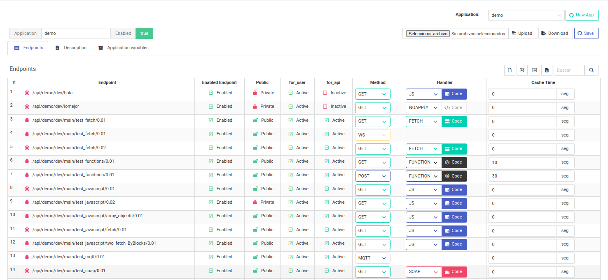
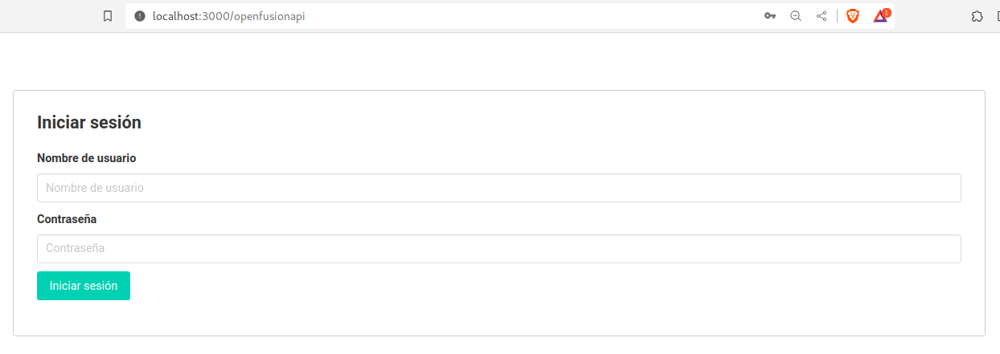

# OpenFusionAPI

OpenFusionAPI is a quick and easy API builder from a web interface.

  

  

It allows you to create mainly APIS that connect with the most popular SQL databases on the market, as well as making connections to other REST or SOAP services.

  

It is easy to use and uses the power of Javascript for the backend and if you want to create a frontend on top of this platform you can use Svelte for the frontend.

  

## Install

To install the project locally, you are required to have a minimum of NodeJS v20 previously installed. Then we follow the following steps:

  

git clone https://github.com/edwinspire/OpenFusionAPI.git

cd OpenFusionAPI

npm install

npm run build

### Environment Variables

There are some environment variables that allow you to make some adjustments to the application.

Create a file called .env in the root of the project with the following content:

  

PORT = 3000

BUILD_DB_ON_START = true

DATABASE_URI_API = "sqlite::memory:"

JWT_KEY = "X98989898*9*9-894"

EXPOSE_DEV_API = "true"

EXPOSE_QA_API = "true"

EXPOSE_PROD_API = "true"

MQTT_ENABLED = "true"

PATH_APP_FUNCTIONS="src/fn"

  

**PORT:** Port used to expose services. Default 3000.

  

**BUILD_DB_ON_START:** It is recommended to have this variable set to true only the first time the application starts so that the database is built and populated with the minimum required data. Default: true. (Optional)

  

**DATABASE_URI_API:** Database connection URI that the application will use to store application data and configurations.

  

By default it uses SQLite in memory, it allows you to work but remember that the data will be lost once you stop executing the program.

  

It has been tested mainly with PostgreSQL, but can also work with MySQL, MS SQL Server, MariaDB and Oracle.

  

To learn how to create a connection URI you can visit [sequelize](https://sequelize.org/docs/v6/getting-started/#connecting-to-a-database)

which is the framework we use internally to manage connections with the database.

  
  

Default: sqlite::memory: **(Required)**

**JWT_KEY:** Key to generate the JWT and create some internal HASH, it is advisable to change it. **(Required)**

  

**EXPOSE_DEV_API

EXPOSE_QA_API

EXPOSE_PRD_API:**

The application has 3 execution environments: Development, Quality and production.

These environment variables indicate whether or not running the program will expose each of the 3 environments.

For example, if you are running in a production environment, only the *EXPOSE_PRD_API* environment variable should be set to **true**. However, if you are running it on your machine to test it, it is recommended that you only expose the Development and Quality environments.

  

**MQTT_ENABLED:** Enable MQTT over Websocket on the server. It is in the process of implementation.

  

**PATH_APP_FUNCTIONS:** It is possible that you create custom functions in Javascript directly in the Backend to use them in your APIs, the path indicates where the .js files with the custom functions will be read from.

  

## Execution

  

npm run start

Now from your browser you can enter http://localhost:3000/openfusionapi

  

  

By default the credentials are:

  

**User:** superuser

  

**Password:** superuser

  
  

Once you have entered you can select the "Application", there are two: "system" and "demo".

  

#

To learn more about how to create the APIs, you can visit the following [tutorial](docs/README.md).

  

#

It is a project under construction that has served me a lot as a base for other personal projects, and I am sure that it can be useful to someone else.

## Project in production
The project is in production for commercial use at the following address: [www.openfusionapi.com](www.openfusionapi.com)