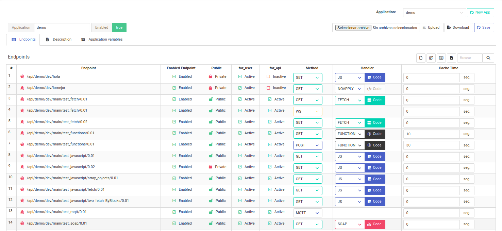
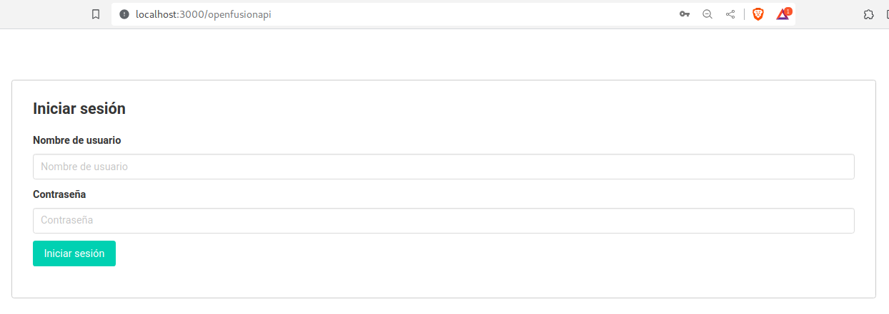
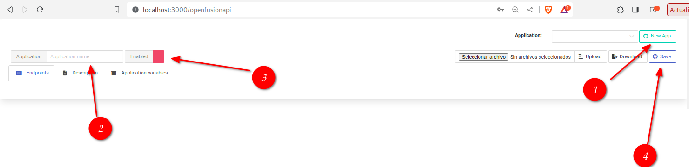

# OpenFusion API

> **Build, deploy, and govern production-ready API endpoints in minutes — without boilerplate.**
>
> **Crea, despliega y gobierna endpoints API listos para produccion en minutos, sin codigo repetitivo.**

[](LICENSE)
[](https://nodejs.org)
[](https://hub.docker.com/r/edwinspire/openfusionapi)
[](http://www.openfusionapi.com)



---

## ES | Resumen Comercial

OpenFusion API es una plataforma **low-code e IA-friendly** para crear servicios API de forma rapida, estandarizada y con control operativo.

- Ya utilizada en produccion: reduce el riesgo de adopcion y acelera decisiones tecnicas.
- Diseñada para humanos y agentes de IA: soporta MCP, contratos con JSON Schema y configuracion reutilizable.
- Ideal para modernizar integraciones: SQL, SOAP, REST, MongoDB, HANA y logica JavaScript en una misma plataforma.
- Orientada a entrega: entornos `dev`, `qa`, `prd`, control de acceso por endpoint, cache y despliegue con Docker.

Para equipos que necesitan velocidad sin perder gobernanza, OpenFusion API reduce el tiempo entre requerimiento y endpoint operativo.

---

## EN | Commercial Snapshot

OpenFusion API is a **low-code, AI-friendly** platform that helps teams ship APIs faster with strong operational controls.

- Production-proven: lowers adoption risk and increases implementation confidence.
- Built for humans and AI agents: MCP support, JSON Schema contracts, and reusable configuration.
- Strong modernization path: SQL, SOAP, REST, MongoDB, HANA, and JavaScript handlers in one platform.
- Delivery-ready model: `dev`, `qa`, `prd` environments, per-endpoint access control, caching, and Docker deployment.

For teams balancing speed and governance, OpenFusion API shortens the path from business intent to live endpoint.

---

## Landing Copy Kit (GitHub & Docker Hub)

### GitHub short copy (ES)

OpenFusion API es una plataforma open-source, low-code e IA-friendly para crear y publicar endpoints API en minutos.
Unifica integraciones SQL, SOAP y REST, incorpora control de acceso, JSON Schema, entornos dev/qa/prd y soporte MCP para agentes de IA.

CTA: **Pruebalo con Docker y publica tu primer endpoint en menos de 15 minutos.**

### GitHub short copy (EN)

OpenFusion API is an open-source, low-code, AI-friendly platform to create and publish API endpoints in minutes.
It unifies SQL, SOAP, and REST integrations with per-endpoint access control, JSON Schema validation, dev/qa/prd environments, and MCP support for AI agents.

CTA: **Run it with Docker and publish your first endpoint in under 15 minutes.**

### Docker Hub short copy (ES)

Imagen oficial de OpenFusion API para desplegar una capa de integracion API lista para produccion.
Incluye soporte para handlers SQL, SOAP, FETCH y JavaScript, con un modelo orientado a equipos tecnicos y agentes de IA.

CTA: **Descarga la imagen y habilita tu capa API en minutos.**

### Docker Hub short copy (EN)

Official OpenFusion API image to deploy a production-ready API integration layer.
Includes SQL, SOAP, FETCH, and JavaScript handlers, designed for both engineering teams and AI-agent workflows.

CTA: **Pull the image and launch your API layer in minutes.**

---

## 🚀 What is OpenFusion API?

OpenFusion API is an **open-source, low-code API platform** that lets developers and AI agents create, configure, and deploy REST endpoints through a clean web interface — without writing repetitive infrastructure code.

## Production-proven platform

OpenFusion API is not a conceptual prototype. It is already used in real deployments and is publicly available at **[www.openfusionapi.com](http://www.openfusionapi.com)**.

Why this matters for adoption:

- **Lower implementation risk**: the platform has already been validated in production-like scenarios.
- **Faster decision cycles**: teams can evaluate with confidence beyond local demos.
- **Operational readiness**: environment segregation, access control, and deployable packaging are already part of the platform model.

---

## OpenFusion ecosystem

OpenFusion API delivers most of its value as an ecosystem of complementary libraries:

| Component | Role in the ecosystem | Strategic benefit |
|---|---|---|
| [libOpenFusionAPI](https://github.com/edwinspire/libOpenFusionAPI) | Core platform engine (endpoint model, handlers, validation, governance) | Standardizes endpoint delivery and reduces repetitive backend coding |
| [libOpenFusionAPIGUI](https://github.com/edwinspire/libOpenFusionAPIGUI) | Svelte-based management interface | Enables faster onboarding for technical and non-specialist integration teams |
| [@edwinspire/universal-fetch](https://github.com/edwinspire/universal-fetch) | Universal HTTP layer for Node/browser and resilient batch requests | Improves reliability in integration-heavy workloads and AI-driven automation flows |

Together they provide a full path from endpoint design to production operation with a model that works for developers, integration teams, and AI agents.

It solves the most common friction points in API development:

| ❌ Traditional approach | ✅ OpenFusion API |
|---|---|
| Write boilerplate for every new endpoint | Select a handler and configure in minutes |
| Manage DB connections per service | One centralized, reusable connection config |
| Rebuild validation logic each time | JSON Schema validation built-in per endpoint |
| Manual environment promotion | `dev` / `qa` / `prd` environments built-in |
| No standard for AI-assisted delivery | Native MCP support — agents can build endpoints autonomously |
| Duplicate credentials across services | App-level variables shared across all endpoints |

---

## 🧩 Problems it solves

- **Slow API delivery** — Most internal tools, integrations, and adapters follow the same structure. OpenFusion API eliminates the boilerplate so you ship faster.
- **Multi-environment complexity** — Separate dev / qa / prd environments are first-class citizens. Each endpoint can be toggled per environment independently.
- **Security overhead** — Access control (Public, Bearer, Private) is configured per endpoint. JWT handling is built in.
- **Integration sprawl** — Connecting to SQL databases, SOAP services, REST APIs, MongoDB, SAP HANA, Telegram bots, and MCP tools from a single platform.
- **AI agent limitations** — Most agents can generate code but have no structured surface to deploy it. OpenFusion API gives AI agents a direct, reliable path to create and publish working endpoints via MCP tooling.

---

## ⚡ Key Features

- **Handler-based architecture** — choose the right handler per endpoint, no custom wiring needed
- **Multi-database support** — PostgreSQL, MySQL, MS SQL Server, MariaDB, Oracle, SQLite, SAP HANA, MongoDB
- **REST & SOAP integration** — consume external REST or SOAP services and expose them as unified REST endpoints
- **JavaScript handler** — run custom JS logic server-side inside a sandboxed handler
- **Response caching** — configurable per-endpoint TTL to reduce backend load
- **JSON Schema validation** — define and enforce the exact shape of input/output data
- **MCP (Model Context Protocol) support** — expose any endpoint as an AI tool with name, title, and description
- **3-tier environments** — dev, qa, prd with independent toggles and variable sets
- **App-level variables** — define credentials, hosts, and reusable values once and reference them anywhere
- **JWT authentication** — built-in token generation and validation
- **PM2 process manager** — production-ready lifecycle management out of the box
- **Docker-ready** — single-command deployment with the official image

---

## Business and technical benefits

- **Shorter time-to-integration**: move from requirement to deployed endpoint in minutes for many API patterns.
- **Consistent governance**: enforce access level, validation, and environment scope from a unified control surface.
- **Modernization without full rewrites**: expose legacy SOAP or heterogeneous backends as standardized REST endpoints.
- **Scalable operating model**: centralize variables, contracts, and endpoint configuration across teams.
- **AI-ready execution layer**: turn AI-generated intent into deployable and testable services, not only source code drafts.

---

## 🧱 Available Handlers

| Handler | Description |
|---|---|
| `SQL` | Execute parameterized queries against any Sequelize-compatible database |
| `SQL_BULK_I` | Bulk insert operations optimized for high-volume data ingestion |
| `FETCH` | Call external REST APIs and relay or transform the response |
| `SOAP` | Convert legacy SOAP/WSDL services into clean REST endpoints |
| `JS` | Run custom JavaScript logic server-side |
| `FUNCTION` | Call reusable functions defined in your backend `src/fn` folder |
| `MONGODB` | Query and mutate MongoDB collections |
| `HANA` | Connect to SAP HANA databases |
| `MCP` | Expose endpoints as MCP tools consumable by AI agents |
| `TELEGRAM_BOT` | Create Telegram bot interaction handlers |
| `TEXT` | Return static or dynamically generated text/file responses |

---

## 🤖 Built for humans and AI agents

OpenFusion API is intentionally designed for both human operators and autonomous AI systems.

**Human developers** use the web UI to create applications, define variables, configure handlers, and publish endpoints in minutes.

**AI agents** can do the same programmatically through MCP-aware workflows:

1. Create or select the target application
2. Define shared variables for each environment
3. Create endpoints with the chosen handler, HTTP method, and access level
4. Attach a JSON Schema for structured contracts
5. Enable the MCP tab to make the endpoint available as an AI tool

This makes OpenFusion API one of the few platforms where an agent can go from **intent to deployed service** without writing a single line of infrastructure code.

### Why this is AI-friendly in practice

- **Structured contracts**: JSON Schema reduces ambiguity in tool invocation.
- **MCP-native exposure**: endpoints can be described and consumed as tools.
- **Reusable configuration model**: app-level variables let agents reuse host/auth settings safely.
- **Reliable network workflows**: the ecosystem can leverage `@edwinspire/universal-fetch` for robust request execution and fail-safe batch patterns.

---

## 🛠 How it can power your own projects

- **Backend for your SvelteKit / React / Vue app** — expose data from any database or service through typed, validated endpoints
- **API gateway layer** — unify multiple backend services (SQL, SOAP, REST) behind a single access point with auth
- **Integration hub** — consolidate results from multiple upstream services into one response
- **Rapid prototyping** — validate API contracts quickly without scaffolding a full backend
- **AI tool server** — let your Copilot, Claude, or GPT-based agents interact with your real data through MCP endpoints
- **Internal tooling platform** — admin panels, reporting APIs, and automation endpoints without dedicated backend teams

---

## 📦 Quick Start

### Option A — Docker (recommended)

```bash
docker compose up -d
```

Then open **http://localhost:3000/openfusionapi**

> Default credentials: **user:** `superuser` / **password:** `superuser`

See [`docker-compose.yml`](docker-compose.yml) for full configuration.

### Option B — Local (Node.js v20+)

```bash
git clone https://github.com/edwinspire/OpenFusionAPI.git
cd OpenFusionAPI
npm install
npm run build
npm run start
```



---

## ⚙️ Environment Variables

Create a `.env` file in the project root:

```env
PORT=3000
BUILD_DB=true
DATABASE_URI_API="sqlite:/data/openfusionapi.sqlite"
JWT_KEY="CHANGE_THIS_TO_A_STRONG_SECRET"
EXPOSE_DEV_API="true"
EXPOSE_QA_API="true"
EXPOSE_PRD_API="true"
PATH_APP_FUNCTIONS="src/fn"
```

| Variable | Description | Required |
|---|---|---|
| `PORT` | Port to expose the server. Default: `3000` | No |
| `BUILD_DB` | Set `true` on first run to initialize the database schema | No |
| `DATABASE_URI_API` | Sequelize-compatible connection URI. Supports PostgreSQL, MySQL, MS SQL Server, MariaDB, Oracle, SQLite | **Yes** |
| `JWT_KEY` | Secret key for JWT token generation and internal hashing | **Yes** |
| `EXPOSE_DEV_API` | Expose the Development environment endpoints | No |
| `EXPOSE_QA_API` | Expose the Quality environment endpoints | No |
| `EXPOSE_PRD_API` | Expose the Production environment endpoints | No |
| `PUBLIC_API_SERVER_HOST` | Public base URL shown in the UI (e.g. `http://yourdomain.com:3000`) | No |
| `PATH_APP_FUNCTIONS` | Directory for custom reusable backend functions | No |

> For database URI syntax, see the [Sequelize documentation](https://sequelize.org/docs/v6/getting-started/#connecting-to-a-database).

---

## 🔄 Recommended endpoint creation workflow

1. **Create an application** — the root container for all your endpoints
2. **Define app variables** — store credentials, hosts, and reusable IDs per environment (dev/qa/prd)
3. **Create endpoints** — select handler, HTTP method, access level, and cache TTL
4. **Add JSON Schema** — enforce the shape of input data, especially useful for MCP tools
5. **Enable MCP (optional)** — expose the endpoint as an AI-consumable tool with name and description
6. **Deploy** — toggle environment exposure and your endpoint is live



---

## 🗄️ Database support

OpenFusion API uses [Sequelize](https://sequelize.org) internally, giving you out-of-the-box support for:

- **PostgreSQL** (recommended for production)
- **MySQL / MariaDB**
- **Microsoft SQL Server**
- **Oracle**
- **SQLite** (default, ideal for development and quick starts)
- **SAP HANA** (via dedicated handler)
- **MongoDB** (via dedicated handler)

---

## 🔐 Access control

Each endpoint independently configures its access level:

| Level | Description |
|---|---|
| **Public** | No authentication required |
| **Bearer** | JWT token required in the `Authorization` header |
| **Private** | Internal use only, not exposed externally |

---

## 🧪 Environment management

The platform separates endpoints into three environments:

- **dev** — active development, safe to experiment
- **qa** — staging and validation
- **prd** — production traffic

Each environment can be independently enabled or disabled via environment variables, making it safe to run the same instance for multiple stages or restrict exposure per deployment target.

---

## 📚 Documentation

- [Tutorial & full guide](docs/README.md)
- [Handler reference](https://github.com/edwinspire/libOpenFusionAPI/blob/main/docs/handlers/README.md)
- [Creating endpoints](https://github.com/edwinspire/libOpenFusionAPI/blob/main/docs/endpoint/README.md)
- [Creating applications](https://github.com/edwinspire/libOpenFusionAPI/blob/main/docs/App/README.md)
- [Core library (libOpenFusionAPI)](https://github.com/edwinspire/libOpenFusionAPI)

---

## 🧑‍💻 Ideal for

- Backend developers who want to ship integrations faster
- API architects standardizing multi-source data access
- Integration engineers replacing SOAP/legacy services with REST
- DevOps teams that want a manageable, container-ready API layer
- Teams using AI tools that need a deployment surface for agent-generated services
- Organizations building internal tooling without dedicated backend headcount
- Technical product teams launching API-backed features under tight delivery windows
- Consultancies and SI teams that must deliver repeatable integrations for multiple clients

---

## Positioning summary

OpenFusion API is an **AI-friendly integration and API delivery platform** that combines low-code speed with production governance. It is designed for organizations that need to ship reliable services quickly while keeping architecture standards, security controls, and operational consistency.

---

## SEO and discoverability keywords

Use and adapt these terms in your website pages, docs, and release notes to improve discoverability:

- low-code API platform
- AI-friendly API platform
- MCP API tools
- SOAP to REST modernization
- SQL to REST API builder
- production-ready API platform
- integration platform for AI agents
- endpoint governance and deployment

---

## 🏭 Production

OpenFusion API is running in production at **[www.openfusionapi.com](http://www.openfusionapi.com)**.

---

## 📄 License

[MIT](LICENSE) — free to use, modify, and distribute.