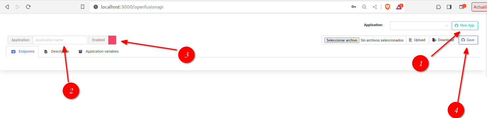

# OpenFusionAPI

**OpenFusionAPI** uses Svelte as a framework for the frontend in conjunction with the adapter-node.

  

This makes development easier by creating reusable and reactive components.

  

To learn about Svelte you can visit the following [tutorial](https://svelte.dev/tutorial/basics).

If on the other hand you need to learn how to create APIs from the web interface you can find a detailed tutorial at [libapiserver](https://github.com/edwinspire/libapiserver).

  # Tutorial
We consider that it is easier and more intuitive to show how to use the application in video.
We provide you with a list of videos that can help you create your own APIs in a simple way.

[Preview](https://youtu.be/GpjXgEJV1bI)

## Install
Before starting, remember to have at least NodeJS v20 installed. It is also recommended to use VSCode, although you can use any text editor.

[Installation process](https://youtu.be/L-DC6mIL9oM)

## Exploring the demo

## Create your own application

It is common to have a large number of APIs for different projects. To keep the APIs in order it has been decided to group them into "applications", therefore the first step is to create an application.

 1. Press the "New App" button
 2. Put a name in the application, keep in mind that spaces or special characters are not allowed.
 3. Enable the application
 4. Press "Save"

Now you can search for it in the list of applications and select it.

## Handlers
### Javascript
With the **javascript handler** driver you can use javascript to create your API functionality. For example, you can make a simple API that receives two parameters and returns the sum of them.

Or you can do something more complicated like make several fetch calls, process those results, and return a response to the client.

[Javascript Handler Tutorial](handlers/javascript.md)

### SQL
With the **sql handler** you can connect to various SLQ database engines, for example: MS Sql Server, PostgreSQL, MariaDB, MySQL and Oracle.

You can give your base API the functionality to do Insert, Update, Delete, Select and call stored procedures

You can store the data for the connection to the database in an application variable or pass it as a parameter in the API request.

[SQL Handler Tutorial](handlers/sql.md)

### Fetch
The **fetch handler** allows you to access and manipulate parts of the HTTP channel, such as requests and responses, using universal-fetch, a layer on top of the fetch standard that makes it easier to use.

With it you can make calls to other internal OpenFusionAPI APIs or external services.

You can see it as something similar to a proxy.

[Fetch Handler Tutorial](handlers/fetch.md)

### SOAP
The **SOAP handler** allows you to easily convert a SOAP service to a REST one.

[SOAP Handler Tutorial](handlers/soap.md)

### Functions
If the API you are building is more complex or requires additional modules then the solution is to use the **Function handler**.

In the Backend you are going to create a javascript file that will contain the logic for your API, this function will be the one that is called from your API to return the result to the user.

[Custom Function Handler Tutorial](handlers/functions.md)

