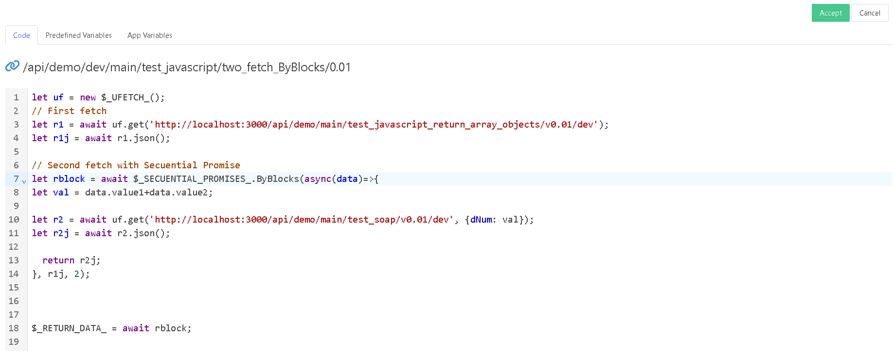

# Javascript Handler

The **Javascript Handler** allows you to create the logic for your API using the power and ease of Javascript. 

From here you can even consume other services using Fetch, preprocessing the data before returning it to the user if you need to.

The manager has a built-in code editor, which makes your work easier.

**$_RETURN_DATA_** is the internal variable that contains the data that will be returned to the user.

## Examples

  ### Basic without params

	$_RETURN_DATA_ = new Date();

### Basic with params GET Method

	$_RETURN_DATA_ = $_REQUEST_.query.par1  *  $_REQUEST_.query.par2;

### Basic with params POST Method

	$_RETURN_DATA_ = $_REQUEST_.body.par1  *  $_REQUEST_.body.par2;

### Call Fetch from javascript

- Url: https://fakestoreapi.com/carts
- Param: userId

		let uf = new $_UFETCH_();
		let r1 = await uf.GET({url: "https://fakestoreapi.com/carts", data: {userId: $_REQUEST_.query.userId}});
		$_RETURN_DATA_ = await r1.json();

### Call Fetch from javascript - Convert GET to POST method

- Url: https://fakestoreapi.com/carts
- Param: userId

		let uf = new $_UFETCH_();
		let r1 = await uf.GET({url: "https://fakestoreapi.com/carts", data: {userId: $_REQUEST_.body.userId}});
		$_RETURN_DATA_ = await r1.json();

[Video tutorial](https://youtu.be/azPkwKMLmhU)