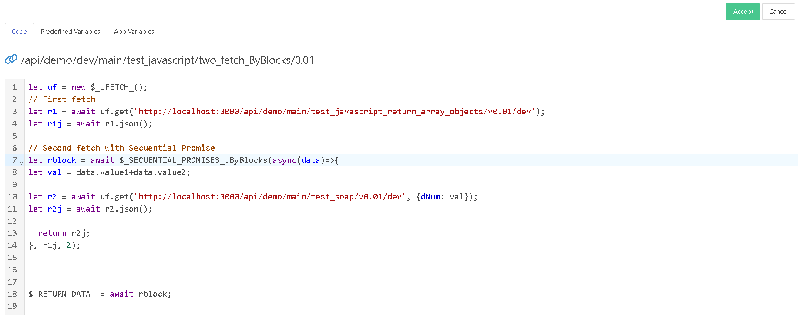

# JS Handler – Server-Side JavaScript Execution

The **JS handler** lets you run raw JavaScript on the server. It is the most flexible handler, suitable for complex logic, data transformation, multi-step orchestration, and AI integration.

The built-in code editor includes tabs for **Code**, **Predefined Variables**, and **App Variables**.



---

## How it works

1. The code in the editor is wrapped in an async function and executed inside a Node.js VM sandbox.
2. Context variables (request, app vars, helpers) are injected into scope automatically.
3. Assign the response to `$_RETURN_DATA_` — do **not** use `return`.
4. Optionally assign a `Map` to `$_CUSTOM_HEADERS_` to set custom response headers.

---

## Available context variables

| Variable | Description |
|---|---|
| `request.query` | Query string parameters (GET) |
| `request.body` | Parsed JSON body (POST), or multipart fields |
| `request.headers` | Incoming HTTP headers |
| `$_APP_VARS_` | Object with all resolved Application Variables for the current environment |
| `$_VAR_*` | Each App Var is also injected directly by name |
| `$_RETURN_DATA_` | Assign this to set the response body |
| `$_CUSTOM_HEADERS_` | Optional `Map<string, string>` for custom response headers |
| `uFetchAutoEnv` | Helper for calling other endpoints in the same instance |
| `request_xlsx_body_to_json(request)` | Parse a multipart XLSX upload into JSON |
| `xlsx_style` | Generate Excel (XLSX) files |
| `nodemailer` | Send emails |
| `askIAWithMCP(options)` | Run an AI chat with optional MCP tool usage |
| `listMcpTools(options)` | Discover tools exposed by MCP servers |

> **Tip:** prefer `$_APP_VARS_['$_VAR_NAME']` in reusable snippets over direct `$_VAR_NAME` — it is explicit and avoids scope ambiguity.

---

## Examples

### Return current date
```javascript
$_RETURN_DATA_ = new Date();
```

### Multiply two GET parameters
```javascript
$_RETURN_DATA_ = request.query.par1 * request.query.par2;
```

### Multiply two POST body fields
```javascript
$_RETURN_DATA_ = request.body.par1 * request.body.par2;
```

### Call an external REST API
```javascript
const uF = uFetchAutoEnv.auto("https://fakestoreapi.com/carts", false);
const r1 = await uF.get({ data: { userId: request.query.userId } });
$_RETURN_DATA_ = await r1.json();
```

### Call another internal OpenFusionAPI endpoint
```javascript
const uF = uFetchAutoEnv.auto("/api/myapp/db/users/auto", true);
const resp = await uF.get({ data: { user_id: request.query.user_id } });
$_RETURN_DATA_ = await resp.json();
```

### Orchestrate two endpoints in parallel and merge results
```javascript
const uF1 = uFetchAutoEnv.auto("/api/myapp/db/account_summary/auto", true);
const uF2 = uFetchAutoEnv.auto("/api/myapp/db/team_members/auto", true);

const [resp1, resp2] = await Promise.all([
	uF1.get({ data: request.query }),
	uF2.get({ data: request.query }),
]);

$_RETURN_DATA_ = {
	accountSummary: await resp1.json(),
	teamMembers:    await resp2.json(),
};
```

### Sequential promises — process array results in batches
```javascript
// First fetch: get array of objects
const uF = uFetchAutoEnv.auto("/api/demo/dev/main/test_javascript_return_array_objects/auto", true);
const r1j = await (await uF.get({})).json();

// Second fetch: process each item in batches of 2
const rblock = await $_SECUENTIAL_PROMISES_.ByBlocks(async (data) => {
	const val = data.value1 + data.value2;
	const uF2 = uFetchAutoEnv.auto("/api/demo/dev/main/test_soap/0.01", true);
	const r2 = await uF2.get({ data: { dNum: val } });
	return await r2.json();
}, r1j, 2);

$_RETURN_DATA_ = await rblock;
```

### Add custom response headers
```javascript
const items = request.body.items || [];
const total = items.reduce((sum, i) => sum + i.price * i.quantity, 0);

$_CUSTOM_HEADERS_ = new Map([['X-Calculated-Total', total.toString()]]);
$_RETURN_DATA_ = { count: items.length, totalValue: total, currency: 'USD' };
```

### Generate and return an XLSX file download
```javascript
const rows = [{ column_1: 'value_1', column_2: 100 }];
const worksheet = xlsx_style.utils.json_to_sheet(rows);
const workbook  = xlsx_style.utils.book_new();
xlsx_style.utils.book_append_sheet(workbook, worksheet, 'Data');
const buffer = xlsx_style.write(workbook, { type: 'buffer', bookType: 'xlsx' });

$_CUSTOM_HEADERS_ = new Map([
	['Content-Type',        'application/vnd.openxmlformats-officedocument.spreadsheetml.sheet'],
	['Content-Disposition', 'attachment; filename="report.xlsx"'],
]);
$_RETURN_DATA_ = buffer;
```

### Send an email using an App Variable transporter
```javascript
const transporter = nodemailer.createTransport($_APP_VARS_['$_VAR_EMAIL_TRANSPORT']);
const info = await transporter.sendMail({
	from:    request.body.from,
	to:      request.body.to,
	subject: request.body.subject,
	html:    request.body.html,
});
$_RETURN_DATA_ = { messageId: info.messageId, accepted: info.accepted };
```

### AI chat with MCP tool usage
```javascript
const result = await askIAWithMCP({
	ai: {
		modelProvider: 'ollama',
		model: 'qwen2.5-coder:1.5b',
		baseUrl: 'http://localhost:11434',
		temperature: 0.1,
		timeout: 1800000,
		responseTimeout: 120000,
	},
	mcpServers: [
		{ name: 'openfusion_prd', url: 'https://your-server.com/api/system/mcp/server/prd' },
	],
	prompts: request.body.prompts,
	includeDiagnostics: false,
});
$_RETURN_DATA_ = result;
```

[Video tutorial](https://youtu.be/azPkwKMLmhU)

---

## Capability summary

| Feature | Supported |
|---|---:|
| Custom logic | ✅ |
| Access request data (body, query, headers) | ✅ |
| Custom response headers | ✅ |
| Async / Await | ✅ |
| Application Variables | ✅ |
| Internal endpoint calls (`uFetchAutoEnv`) | ✅ |
| XLSX generation and parsing | ✅ |
| Email sending (`nodemailer`) | ✅ |
| AI + MCP integration (`askIAWithMCP`) | ✅ |
| Sandboxed execution | ✅ (Node.js VM) |